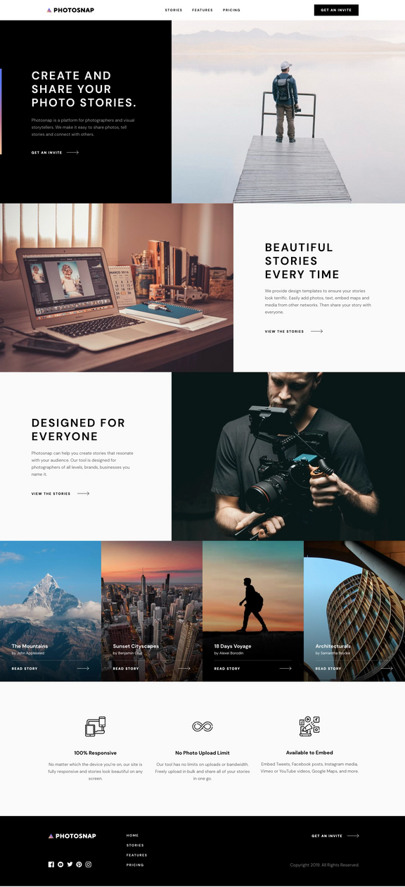
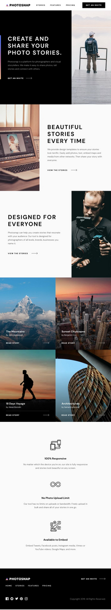

# 📸 Photosnap Multi-Page Website

A visually appealing marketing site for a photo-sharing app. This project focuses on clean layout using **Tailwind CSS** with a **component-based architecture** and ensures **responsive design** for desktop, tablet, and mobile screens.

🔗 **Live Demo**: [https://photosnap-react-website.vercel.app](https://photosnap-react-website.vercel.app)

---

## 🧱 Tech Stack

- React 19
- TypeScript
- Tailwind CSS
- Vite
- Zustand (State Management)
- React Router v7

---

## 📱 Responsive Previews

| Desktop                        | Tablet                        | Phone                        |
| ------------------------------ | ----------------------------- | ---------------------------- |
|  |  |  |

---

## ✨ Features

- Multi-page layout with React Router
- Fully responsive: works great on desktop, tablet, and phone
- Modern responsive design using Tailwind utility classes
- State management with Zustand
- Type-safe development with TypeScript
- Clean, minimalist design with accessibility in mind
- Lazy-loaded pages for better performance

---

## 🛠️ Project Setup

```bash
npm install
```

### Compiles and hot-reloads for development

```bash
npm run dev
```

### Compiles and minifies for production

```bash
npm run build
```

### Preview production build locally

```bash
npm run preview
```

### Lints and fixes files

```bash
npm run lint
```

### Run tests

```bash
npm run test
```

---

## 📂 Project Structure

```
src/
├── components/       # Reusable UI components
│   ├── common/       # Layout components (Header, Footer, etc.)
│   ├── feature/      # Feature-specific components
│   └── stories/      # Story-related components
├── pages/            # Page components
├── store/            # Zustand state management
├── types/            # TypeScript interfaces and types
└── App.tsx           # Main app component with routing
```
