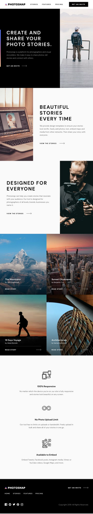

# 📸 Photosnap Multi-Page Website

A visually appealing marketing site for a photo-sharing app. This project focuses on clean layout using **CSS Grid** and ensures **responsive design** for desktop, tablet, and mobile screens.

🔗 **Live Demo**: [https://photosnap-multi-page-website.vercel.app](https://photosnap-multi-page-website.vercel.app)

---

## 🧱 Tech Stack

- Vue.js  
- HTML5  
- CSS Grid & Flexbox  
- Responsive Design Principles

---

## 📱 Responsive Previews

| Desktop                     | Tablet                     | Phone                     |
|----------------------------|----------------------------|---------------------------|
|     |      |      |

---

## ✨ Features

- Multi-page layout for better user navigation
- Fully responsive: works great on desktop, tablet, and phone
- Modern CSS layout techniques using Grid and Flexbox
- Clean, minimalist design with accessibility in mind

---

## 🛠️ Project Setup

```bash
yarn install
```

### Compiles and hot-reloads for development

```bash
yarn serve
```

### Compiles and minifies for production

```bash
yarn build
```

### Lints and fixes files

```bash
yarn lint
```

### Customize configuration

See [Configuration Reference](https://cli.vuejs.org/config/).
